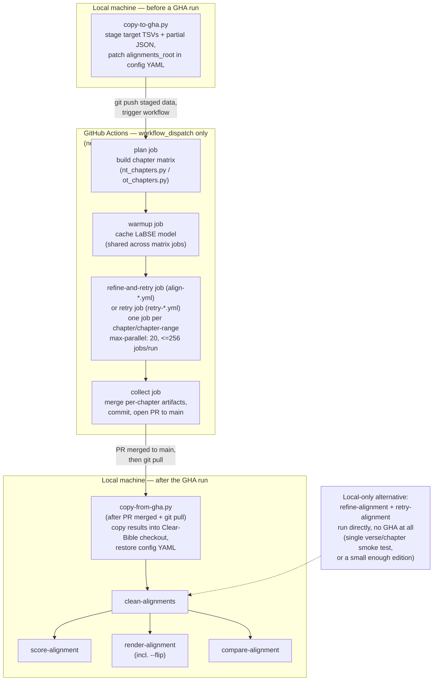

# Where each alignment step runs: local vs. GitHub Actions

Summary of which CLI tools in the alignment pipeline can/must run on a local
machine versus GitHub Actions (GHA), based on `.github/workflows/` and
`scripts/copy-to-gha.py` / `scripts/copy-from-gha.py`.

## Summary table

| Step | Tool | Where it runs | Parallelism |
|---|---|---|---|
| 0. Stage data for a GHA run | `copy-to-gha.py` | **Local only** | — |
| 1. First-pass alignment | `refine-alignment` | Local **or** GHA (`align-nt.yml` / `align-ot.yml`) | GHA: one job per chapter (or bundled NT chapter-pair), `max-parallel: 20`, ≤256 jobs per workflow run |
| 2. Quality-repair pass | `retry-alignment` | Local **or** GHA (inline inside `align-*.yml`'s job, or standalone `retry-nt.yml` / `retry-ot.yml`) | same matrix pattern as refine |
| 3. Validate/repair JSON | `clean-alignments` | **Local only** | — |
| 4. Quality audit | `score-alignment` | **Local only** | — |
| 5. Pull GHA results back | `copy-from-gha.py` | **Local only** | — |
| 6. Visualize | `render-alignment` (incl. `--flip`) | **Local only** | — |
| 7. Compare vs. Biblica reference | `compare-alignment` | **Local only** | — |

Only refine and retry have a GHA path at all — they're the LLM-cost-heavy,
embarrassingly-parallel-by-chapter steps that actually benefit from fanning
out across many runners. Clean/score/render/compare are cheap, fast,
local-file operations with no `.github/workflows/*.yml` automating them —
confirmed by listing the directory: it holds exactly `align-nt.yml`,
`align-ot.yml`, `retry-nt.yml`, `retry-ot.yml` and nothing else.

Refine/retry running on GHA is a scaling choice, not an inherent property of
the tools — the same CLI commands run locally too (e.g. via `--verse`/
`--chapter` for a quick smoke test, per CLAUDE.md's Testing section). GHA is
just how a full-edition run (hundreds of chapters) gets parallelized instead
of processed sequentially on one machine.

## How to decide: local vs. GHA (refine/retry only)

There's no flag that means "run on GHA" — it's two separate invocations of
the same underlying logic (`poetry run refine-alignment ...` locally vs.
`gh workflow run align-nt.yml --field config=...` remotely), so the decision
comes down to **scope** and a few hard constraints below.

**Default to local when:**
- Testing a change (prompt tweak, new language config, scoring threshold) —
  use `--verse BBCCCVVV` or `--chapter BBCCC` (both flags, on both
  `refine-alignment` and `retry-alignment`) to scope to a single unit.
  Spinning up a GHA workflow for one chapter is pure overhead.
- The provider/API key you're using isn't in the repo's GHA secrets yet
  (`OPENAI_API_KEY`, `ANTHROPIC_API_KEY`, `GEMINI_API_KEY`,
  `OPENROUTER_API_KEY`, `GLOO_CLIENT_ID`/`GLOO_CLIENT_SECRET` — see
  `align-nt.yml`'s `env:` block). GHA can only use what's registered as a
  repo secret; a key that only lives in your local `.env` isn't visible to
  the workflow at all until someone adds it in repo settings.
- `--book BB` / `--book-range BB BB` / `--chapter BBCCC` / `--chapter-range
  BBCCC BBCCC` (all four exist on both `refine-alignment` and
  `retry-alignment`) narrow the run to a handful of chapters — small enough
  that local sequential processing finishes in a reasonable time.

**Move to GHA when:**
- Running a full edition (a whole NT or one OT section) — this is exactly
  the scale the chapter-matrix parallelism exists for; running it locally
  means one machine processing hundreds of chapters sequentially instead of
  20 at a time.
- You want the run to survive your machine sleeping/closing — GHA runners
  keep going independently once triggered.
- `--skip-existing` (`skip-existing` workflow input, both `align-*.yml`
  workflows) matters here: a GHA run can be safely re-triggered over a
  partially-completed edition and it'll skip chapters whose output file
  already exists, rather than reprocessing everything — makes GHA practical
  for resuming after a partial failure.

**Constraints that can force the choice either way:**
- **`timeout-minutes: 360`** — every matrix job in all four workflows has a
  hard 6-hour cap. A chapter-range with a slow/high-reasoning-effort model
  and no async batching can hit this on GHA; locally there's no such cutoff
  (though you're then bound by however long you're willing to leave the
  process running). If a config's `retry_llm_model` is an expensive
  thinking/reasoning model, check that the matrix job's chapter-range is
  small enough to finish inside 6 hours, or use `--batch-mode async`
  (below) to sidestep the wall-clock limit entirely.
- **`--batch-mode async`** (CLI flag; also the `batch-mode` workflow input)
  is a third option distinct from "local sync" and "GHA sync matrix": it
  submits verses to the LLM provider's own batch API and returns
  immediately — `fetch-batch` retrieves results later, from wherever you
  run it (local or GHA). This means a very large local-only run doesn't
  strictly need GHA's job-parallelism to avoid tying up your machine for
  hours; it needs only enough time to submit the batch, and a later
  `fetch-batch --wait` (or `--poll`) call to collect it. Async mode is not
  supported for `openrouter` or `gloo` (sync-only providers), so this
  option is only available with `openai`, `anthropic`, or `google`.
- **Cost-safety knobs** (`include_suspect`, `suspect_cost_per_verse_max`,
  `suspect_cost_max`, `fallback_threshold` in the config YAML) bound how
  much a retry pass can spend before falling back to a cheaper model or
  skipping suspect verses. Worth tightening these for a first local test of
  a new/expensive `retry_llm_model` before trusting a much larger GHA run
  (20 chapters in parallel) to the same settings.

## Setting up this repo's GHA secrets

**Current state, verified directly rather than assumed:** running `gh secret
list` against this repo returns empty (exit code 0, valid `repo`-scoped
auth) — **none of the six provider secrets are configured yet.** Triggering
any of the four workflows right now would run the matrix job with those env
vars unset, and every LLM call inside it would fail authentication.

**Why they're needed at all:** `align-nt.yml`'s matrix job injects them as
env vars via `${{ secrets.OPENAI_API_KEY }}` etc. (and the equivalent in the
other three workflows). GHA runners are fresh, isolated VMs with no access
to your machine's filesystem, so a key that only lives in your local `.env`
is invisible to a workflow run until it's explicitly registered as a GitHub
secret — copying `.env` values in is a one-time, per-repo setup step, not
something that happens automatically alongside a `git push`.

**Which secrets, and where they're read (`env:` block, `align-nt.yml:118-123`
and the equivalent block in the other three workflows):**

| Secret name | Provider | Only needed if a deployed config uses... |
|---|---|---|
| `OPENAI_API_KEY` | OpenAI | `llm_provider: openai` |
| `ANTHROPIC_API_KEY` | Anthropic | `llm_provider: anthropic` |
| `GEMINI_API_KEY` | Google | `llm_provider: google` |
| `OPENROUTER_API_KEY` | OpenRouter | `llm_provider: openrouter` |
| `GLOO_CLIENT_ID` + `GLOO_CLIENT_SECRET` | Gloo AI Studio | `llm_provider: gloo` (e.g. `CUV.yaml`) |

Only the secret(s) matching the `llm_provider` / `retry_llm_provider` actually
set in the config(s) you plan to run on GHA are required — no need to
populate all six up front.

**How to set them — either works, this repo has used neither yet:**

1. **Web UI**: repo → **Settings** → **Secrets and variables** → **Actions**
   → **New repository secret** → **Name** must exactly match a name from the
   table above → paste **Value** → **Add secret**.
2. **`gh` CLI**:
   ```bash
   gh secret set GLOO_CLIENT_ID --body "<value>"
   gh secret set GLOO_CLIENT_SECRET --body "<value>"
   # or, to keep the value out of shell history:
   gh secret set OPENAI_API_KEY < path/to/keyfile
   ```

**Who can do it:** requires **admin** access to the repo — "Secrets and
variables" is gated separately from ordinary write/push access.

**Properties worth knowing:**
- Secrets are **write-only** once set — neither the UI nor `gh secret list`
  will ever show a value again, only that a secret with that name exists and
  when it was last updated. Rotating one means overwriting it the same way.
- Only the job that references a secret in its `env:` block receives it —
  here, that's the `refine-and-retry`/`retry` matrix job specifically, never
  `plan` or `warmup`.
- `GITHUB_TOKEN` (used by the `collect` job to `git push` a branch and
  `gh pr create`) is the one exception: GitHub auto-generates and injects it
  per run, no manual secret needed. What it's allowed to do is controlled by
  the job's `permissions:` block instead (`contents: write`,
  `pull-requests: write` — confirmed present only on the `collect` job in
  all 4 workflow files).
- No fork-PR exposure risk here: all 4 workflows are `workflow_dispatch`-only
  (no `pull_request` trigger), so secrets are never exposed to a workflow run
  triggered by an external contributor's PR — a real concern for repos that
  auto-run workflows on incoming PRs, but not this one.

## Diagram



## Concurrency notes

- **`max-parallel: 20`**: even a 256-entry matrix doesn't run all at once — 20
  chapters process concurrently, the rest queue and start as slots free up.
- **NT (260 raw chapters, 4 over the 256 cap)**: `nt_chapters.py` bundles just
  the 4 shortest adjacent chapter-pairs into single jobs (e.g. `1 Thess 1 + 1
  Thess 2`), landing the matrix at exactly 256 — only 4 of 260 chapters lose
  per-chapter isolation.
- **OT (929 raw chapters, ~3.6x the cap)**: bundling enough to fit under 256
  would average ~3.6 chapters per job, eroding per-chapter fault isolation
  project-wide. Instead the OT is split into 4 canonical sections — law (187
  ch), history (249), poetry (243), prophets (250) — each already under 256
  on its own, so **zero bundling is needed anywhere**. Each section is
  triggered as its own separate `align-ot.yml` run via the `section` input.
- Within one chapter's job, refine → retry is **sequential** (the retry loop
  runs after refine completes, up to `max-retry-passes` times); it's
  *different chapters* that run in parallel with each other, not the
  refine/retry steps within one chapter.
- `--batch-mode async` is a separate, provider-side concurrency mechanism
  (handing verses to the LLM provider's own batch API) — orthogonal to GHA's
  job-level matrix parallelism, and available in both local and GHA runs.
