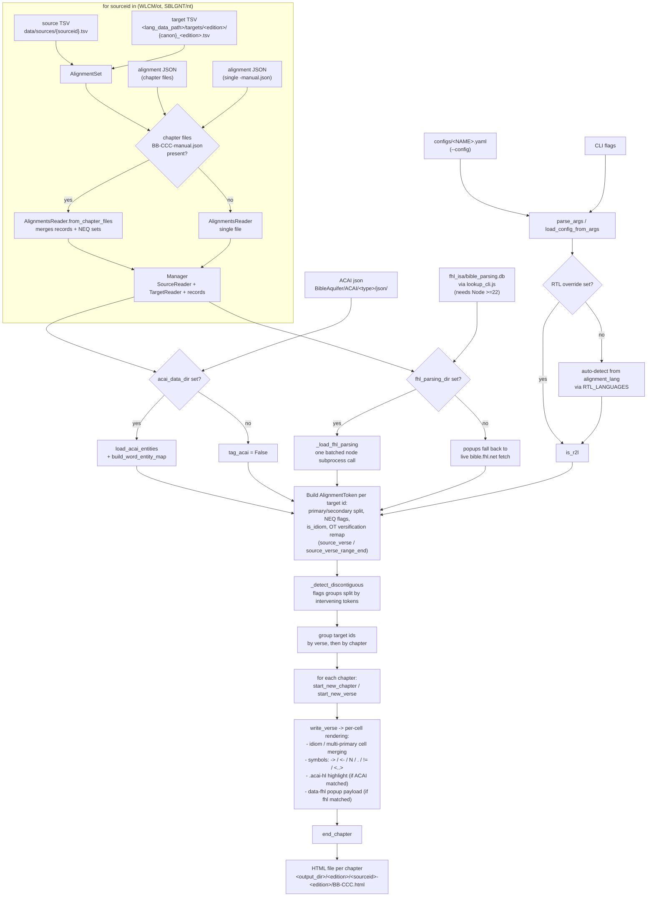

# render-alignment workflow

How `render-alignment` turns one source/target pair (e.g. `SBLGNT` + `CUV`)
into the per-chapter HTML visualization under `<viz-dir>/<edition>/<sourceid>-<edition>/`.
Entry point: `main()` in `src/text_align/render/html.py`.

## Inputs

| Input | Where it comes from | Required? | If missing |
|---|---|---|---|
| **Config** (`--config NAME`) | `configs/<NAME>.yaml`, merged with any explicit CLI flags | Effectively yes | Falls back to bare CLI args; `require()` aborts if `alignment_lang`/`alignment_edition`/`lang_data_path`/`output_dir` are still unset |
| **Source TSV** | `data/sources/{SBLGNT.tsv \| WLCM.tsv}` — one fixed token per Greek/Hebrew word | Yes | `AlignmentSet.__post_init__` asserts `sourcepath` exists; that corpus (NT or OT) is skipped |
| **Target TSV** | `<lang_data_path>/targets/<edition>/{nt\|ot}_<edition>.tsv` — one token per translation word | Yes | Same assertion; corpus skipped |
| **Alignment JSON** | Either chapter files `{sourceid}-{edition}-BB-CCC-manual.json` (preferred, auto-detected) or one whole-corpus `{sourceid}-{edition}-manual.json`, under `--alignment-dir` (defaults to `<lang_data_path>/alignments/<edition>/`) | Yes | Corpus skipped |
| **ACAI data** (`--acai-data-dir` / `acai_data_dir`) | A checkout of `BibleAquifer/ACAI` (`people/`, `places/`, `groups/`, … `json/` folders) | No | ACAI highlighting is silently disabled (`tag_acai = False`) |
| **fhl_isa data** (`--fhl-parsing-dir` / `fhl_parsing_dir`) | A checkout of `fhl_isa/` (`lookup_cli.js` + `bibleParsingLookup.js` + `bible_parsing.db`), plus `--fhl-node-bin` / `fhl_node_bin` (a Node ≥22 binary) | No | Click-popups fall back to a live `bible.fhl.net` fetch per word instead of baked-in local morphology |
| **RTL override** (`--r2l`/`--no-r2l`) | CLI/YAML, else auto-detected from `alignment_lang` via `RTL_LANGUAGES` | No | Auto-detected |

## Workflow



## Output

One HTML file per chapter, e.g.:

```
<output_dir>/CUV/SBLGNT-CUV/40-005.html
```

Each file's `<h1>`-adjacent meta row reports the edition, LLM provider/model/
reasoning effort (read back from the alignment JSON's `group_meta["llm"]`),
and the render date (`_build_meta_row`, `AlignmentsReader.group_meta`).

## Key dependency notes

- **NT vs OT run independently in the same invocation** — one `render-alignment`
  call renders both `WLCM` (OT) and `SBLGNT` (NT) sources against the same
  edition's target TSVs, whichever pair(s) actually have alignment data on
  disk. Missing one corpus's alignment file just skips that corpus, not the
  whole run.
- **Chapter-file merge is transparent** — `AlignmentsReader.from_chapter_files`
  merges `groups[0].records` and NEQ sets from every matched chapter file into
  one in-memory reader, so the rest of the pipeline (`Manager`, cell
  rendering) doesn't need to know whether the alignment data was one big file
  or many small ones.
- **ACAI and fhl_isa are independent optional enrichments** — neither affects
  whether rendering succeeds; each only adds or omits a visual feature
  (entity highlight span / baked-in morphology popup) depending on whether its
  data directory was supplied and successfully loaded.
- **`fhl_node_bin` must match the container/host's actual Node install** — the
  native `better-sqlite3` binding `bibleParsingLookup.js` depends on is
  ABI-specific; a mismatched Node version makes the lookup fail silently
  (falls back to live `bible.fhl.net`), it does not raise a visible error in
  `render-alignment` itself.
